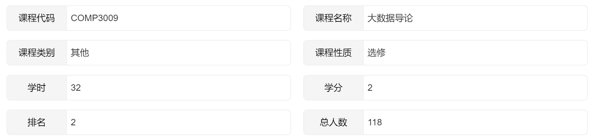

# 2022_HITSZ_IBD-Labs-Hw

哈尔滨工业大学（深圳）2022年秋季学期《大数据导论》课程实验与作业

## 项目简介

这门课程没有期末考试，成绩全部由实验、作业、大作业等构成，内容主要围绕**传统机器学习理论**进行，各部分占比如下：（总成绩满分100分）

| 分项     | 比重 |
| -------- | ---- |
| 作业1    | 10%  |
| 作业2    | 10%  |
| 课堂小测 | 10%  |
| 实验1    | 15%  |
| 实验2    | 15%  |
| 大作业   | 40%  |

作者在这门课程上最终**只有大作业扣了3分**，总成绩为**97分（排名2/118）**，其中**大作业的预测性能表现排名第3**。这个项目包含了作者在作业1、作业2、实验1、实验2、大作业上的作答（具体可查看各子目录）。

## 各实验及作业介绍

|        | 名称                               | 主要内容                                                     |
| ------ | ---------------------------------- | ------------------------------------------------------------ |
| 实验1  | Hadoop环境配置与基本操作           | 掌握Hadoop分布式环境的配置方法、Mapreduce作业的操作原理，对作业1得到的分词结果进行词频统计。 |
| 实验2  | 数据理解、数据预处理及决策树的应用 | 在不调用sklearn等现有机器学习库的前提下，实现决策树分类器并在经典Adult数据集上完成预测。 |
| 作业1  | 爬虫的解析与存储                   | 爬取至少一万个网页，对网页内容进行解析，将所有解析得到的内容进行分词处理后，合并成为一个大文件存储下来。 |
| 作业2  | FP增长算法                         | 使用FP增长算法找到所有的频繁项集。                           |
| 大作业 | 房屋交易价格预测                   | 设计高效、解释性强的算法对房屋交易价格进行预测。             |
